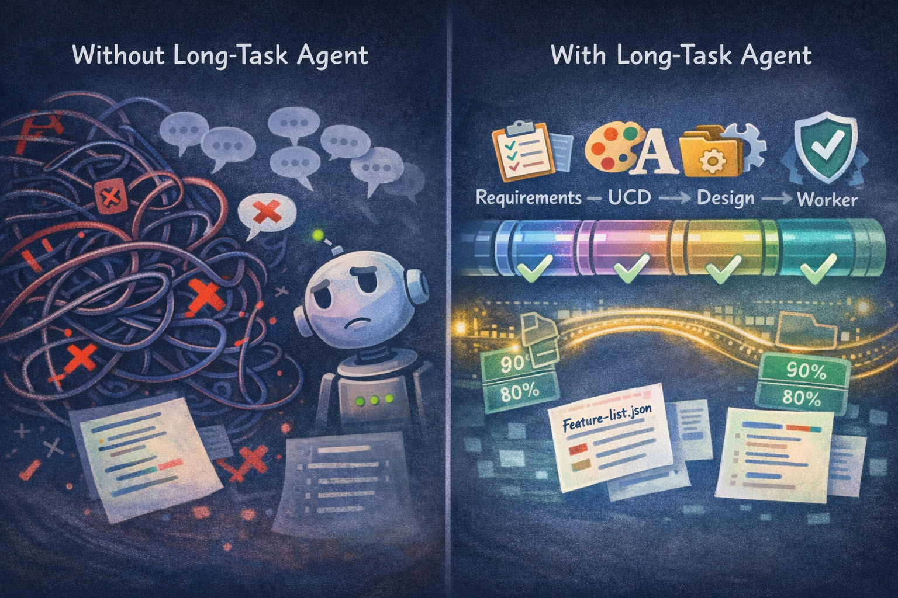
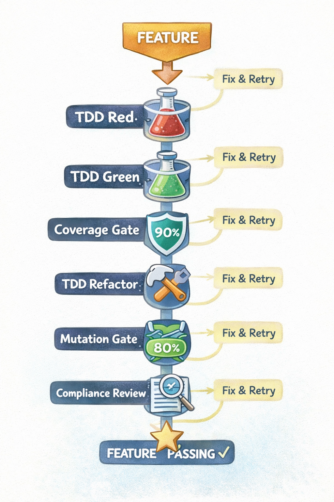
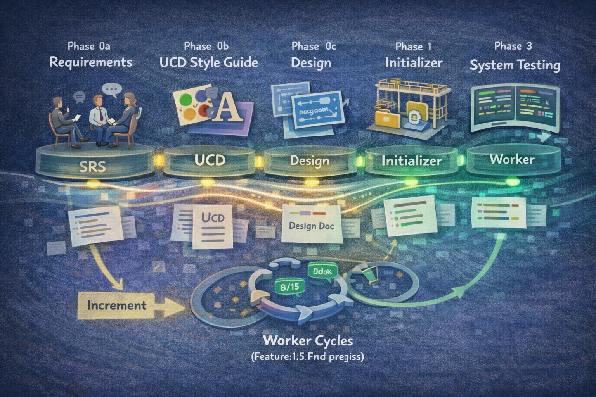
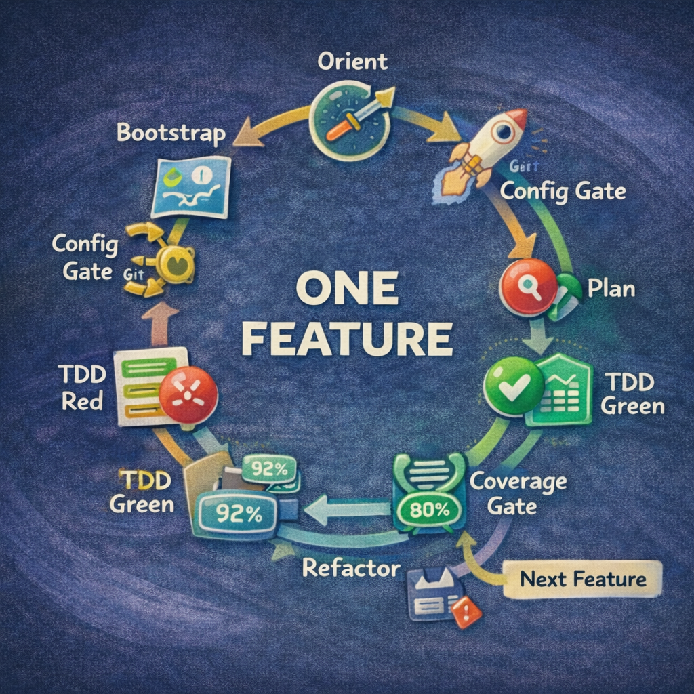
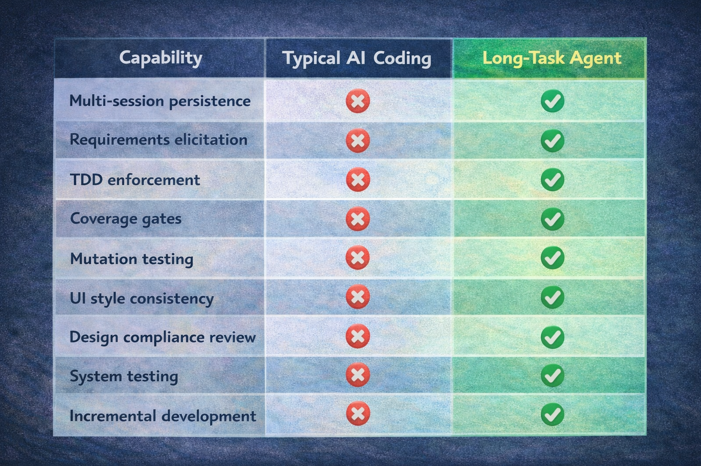
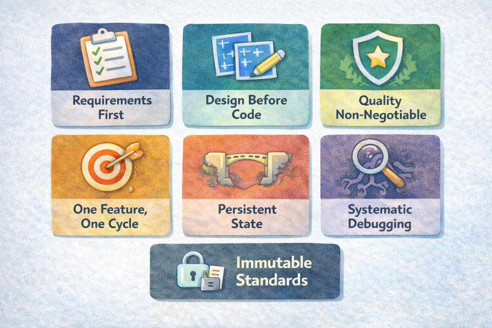

# Language / 语言

**[English](README_EN.md)** | **[中文](README.md)**

---

# Quick Start

### 1. Installation

In Claude Code, register the marketplace first:

```bash
/plugin marketplace add suriyel/longtaskforagent
```

Then install the plugin from this marketplace:

```shell
/plugin install long-task@longtaskforagent
```

### 2. Quick Start

After launching Claude Code, simply tell it what you want to build:

```
> I want to build a weather query mini-app. use `long task skill`.
```

The system will automatically enter the **Requirements phase**, helping you refine requirements through structured questioning and ultimately generate a standardized SRS document. The subsequent workflow is fully automated:

```
Requirements → UCD (if UI) → Design → Init → Worker cycles → System Testing
```

Or use shortcut commands to jump directly to the corresponding phase:

```
/long-task:requirements  — Start requirements elicitation
/long-task:ucd           — Generate UCD style guide
/long-task:design        — Start design phase
/long-task:init          — Initialize project after design approval
/long-task:work          — Start feature development
/long-task:st            — Run system testing
/long-task:increment     — Incremental development (add new features)
```

### OpenCode Users

If you use [OpenCode](https://opencode.ai) instead of Claude Code, install with a single command:

**macOS / Linux:**

```bash
curl -fsSL https://raw.githubusercontent.com/suriyel/longtaskforagent/main/install.sh | bash
```

**Windows (PowerShell — requires Developer Mode or Administrator):**

```powershell
irm https://raw.githubusercontent.com/suriyel/longtaskforagent/main/install.ps1 | iex
```

Restart OpenCode after installation. See the [OpenCode Installation Guide](docs/README.opencode.md) for full details.

---

# Long-Task Agent

**A Claude Code skill plugin that turns single-session AI coding into a rigorous, multi-session software engineering workflow.**

Most AI coding assistants lose context after one conversation. Long-Task Agent solves this by implementing a six-phase architecture with persistent state bridging — enabling Claude Code to build complex projects across unlimited sessions with the discipline of a professional engineering team.


## Why Long-Task Agent?

| Problem | How Long-Task Agent Solves It |
|---------|-------------------------------|
| AI forgets everything after `/clear` | Persistent artifacts (`feature-list.json`, `task-progress.md`, git history) bridge sessions automatically |
| AI generates code without understanding requirements | ISO/IEC/IEEE 29148-aligned requirements elicitation produces an approved SRS before any code is written |
| AI skips testing or writes shallow tests | Strict TDD (Red→Green→Refactor) with coverage gates (≥90% line, ≥80% branch) and mutation testing (≥80% score) |
| AI produces inconsistent UI | UCD style guide with token-based design system ensures visual consistency across all features |
| AI drifts from the approved design | Automated spec & design compliance review after every feature |
| No way to add features to an existing project safely | Increment skill performs impact analysis, updates SRS/Design/UCD in place, tracks changes with waves |
| "Works on my machine" syndrome | System Testing phase (IEEE 829) with regression, integration, E2E, and NFR verification |



## Core Philosophy

### 1. Requirements-Driven, Not Code-First

Every project starts with structured requirements elicitation — not coding. The SRS captures the *what*, the UCD captures the *look*, and the design document captures the *how*. No code is written until all three are approved.

### 2. Persistent State Bridges Sessions

Ten+ persistent artifacts ensure zero knowledge loss between sessions:

| Artifact | Purpose |
|----------|---------|
| `feature-list.json` | Structured task inventory with status tracking (JSON prevents model corruption) |
| `task-progress.md` | Session-by-session log with current state header |
| `docs/plans/*-srs.md` | Approved Software Requirements Specification |
| `docs/plans/*-design.md` | Approved technical design document |
| `docs/plans/*-ucd.md` | Approved UCD style guide (UI projects) |
| `long-task-guide.md` | Worker session guide with env activation + tool commands |
| `docs/test-cases/feature-*.md` | Per-feature ST test case documents (ISO/IEC/IEEE 29119) |
| `docs/plans/*-st-plan.md` | System testing plan with RTM |
| `docs/plans/*-st-report.md` | System testing report with Go/No-Go verdict |
| `RELEASE_NOTES.md` | Living changelog in Keep a Changelog format |
| Git history | Full change history with descriptive commits |

### 3. Quality is Non-Negotiable

Every feature passes through a gauntlet of automated quality gates — no exceptions, no shortcuts:

- **TDD Red→Green→Refactor** — tests are written before code, always
- **Coverage Gate** — line ≥90%, branch ≥80%
- **Mutation Gate** — mutation score ≥80% (catches tests that pass without actually testing anything)
- **Spec & Design Compliance Review** — every feature is checked against the SRS and design doc
- **UCD Compliance** — UI features are verified against style tokens

### 4. One Feature Per Cycle

Each worker session focuses on exactly one feature. This prevents context exhaustion, ensures clean commits, and keeps every feature independently verifiable.



## Six-Phase Architecture




### Phase 0a: Requirements Elicitation

- Structured questioning aligned with ISO/IEC/IEEE 29148
- EARS requirement templates (Given/When/Then acceptance criteria)
- Anti-pattern detection: weasel words, compound requirements, design leakage
- Produces an approved **SRS** (`docs/plans/*-srs.md`)

### Phase 0b: UCD Style Guide

- Defines visual direction, color tokens, typography, spacing
- Generates text-to-image prompts for component mockups
- Auto-skips for non-UI projects
- Produces an approved **UCD** (`docs/plans/*-ucd.md`)

### Phase 0c: Design

- Proposes 2-3 approaches with trade-offs
- Per-feature Mermaid diagrams (class, sequence, flow)
- Third-party dependency versions with compatibility verification
- Produces an approved **Design Document** (`docs/plans/*-design.md`)

### Phase 1: Initialization

- Reads SRS + Design, scaffolds project skeleton
- Decomposes requirements into 10-200+ verifiable features
- Generates environment bootstrap scripts (`init.sh` / `init.ps1`)
- Creates initial git commit

### Phase 2: Worker Cycles

Each cycle follows a strict discipline:

```
Orient → Bootstrap → Config Gate → DevTools Gate → Plan
  → TDD Red → TDD Green → Coverage Gate
    → TDD Refactor → Mutation Gate
      → Feature ST (Black-Box) → Compliance Review
        → Add Examples → Persist → Next Feature
```

### Phase 3: System Testing

- Per-feature ST (ISO/IEC/IEEE 29119) — black-box acceptance testing via Chrome DevTools MCP
- IEEE 829-aligned system-level test planning with Requirements Traceability Matrix
- Regression, integration, E2E, NFR verification, exploratory testing
- Go/No-Go verdict — defects loop back to Worker for fixes

### Phase 1.5: Increment (Post-Launch Changes)

- Place an `increment-request.json` signal file → the skill auto-detects it
- Impact analysis against existing features
- Updates SRS, Design, UCD in place (git tracks history)
- Appends new features with wave metadata for traceability
  

## 12-Skill Superpowers Architecture

Long-Task Agent uses an **on-demand skill loading** pattern — only the bootstrap router is loaded at session start; phase skills are loaded as needed, keeping context lean.

```
using-long-task (bootstrap router — always loaded)
   │
   ├─→ long-task-requirements ──→ long-task-ucd ──→ long-task-design ──→ long-task-init
   │                              (auto-skip if no UI)                        │
   │                                                                          ↓
   ├─→ long-task-increment (if increment-request.json exists)          long-task-work
   │                                                                     │  │  │  │
   │                                                              ┌───────┘  │  └──────┴─────┐
   │                                                              ↓          ↓                ↓
   │                                                         long-task  long-task       long-task
   │                                                           -tdd     -quality       -feature-st
   │                                                              │           │
   │                                                              └───────────┴──────→ long-task
   │                                                                           -review
   │
   └─→ long-task-st (when all features pass)
```

| Skill | Role |
|-------|------|
| `using-long-task` | Bootstrap router — detects project state, invokes correct phase |
| `long-task-requirements` | ISO 29148 requirements elicitation → SRS |
| `long-task-ucd` | UCD style guide with design tokens |
| `long-task-design` | Technical design with trade-off analysis |
| `long-task-init` | Project scaffolding and feature decomposition |
| `long-task-work` | Worker orchestrator (one feature per cycle) |
| `long-task-tdd` | TDD Red→Green→Refactor discipline |
| `long-task-quality` | Coverage gate + mutation gate |
| `long-task-feature-st` | Per-feature black-box acceptance testing (Chrome DevTools MCP + ISO/IEC/IEEE 29119) |
| `long-task-review` | Spec, design, and UCD compliance review |
| `long-task-increment` | Post-launch feature additions with impact analysis |
| `long-task-st` | IEEE 829 system testing with Go/No-Go verdict |

---

## Multi-Language Support

Long-Task Agent is language-agnostic. It supports any tech stack through configurable tool settings:

| Language | Test Framework | Coverage | Mutation Testing |
|----------|---------------|----------|------------------|
| Python | pytest | pytest-cov | mutmut |
| Java | JUnit | JaCoCo | PIT (pitest) |
| TypeScript | Vitest / Jest | c8 / istanbul | Stryker |
| C/C++ | Google Test | gcov + lcov | Mull |
| *Custom* | *Any* | *Any* | *Any* |

The `tech_stack` field in `feature-list.json` drives all tool commands — use `get_tool_commands.py` to eliminate per-language lookup:

```bash
python long-task-agent/scripts/get_tool_commands.py feature-list.json
```

---

## Validation & Safety Scripts

The plugin includes a suite of validation scripts to prevent common failures:

| Script | Purpose |
|--------|---------|
| `validate_features.py` | Validates `feature-list.json` schema and data integrity |
| `validate_guide.py` | Validates `long-task-guide.md` structural completeness |
| `check_configs.py` | Verifies required environment configs before feature work |
| `check_devtools.py` | Verifies Chrome DevTools MCP availability for UI features |
| `check_st_readiness.py` | Confirms all features pass before system testing |
| `validate_increment_request.py` | Validates increment request signal file |
| `validate_st_cases.py` | Validates ST test case document (ISO/IEC/IEEE 29119) |
| `get_tool_commands.py` | Maps tech stack to CLI commands |
| `analyze-tokens.py` | Analyzes UCD design tokens from generated images |
| `auto_loop.py` | Automated workflow runner for multi-feature sessions |

---

## How It Compares

<!-- ILLUSTRATION: Comparison Matrix


> **Text-to-image prompt**: A feature comparison matrix rendered as a clean infographic table. Rows represent capabilities: "Multi-session persistence", "Requirements elicitation", "TDD enforcement", "Coverage gates", "Mutation testing", "UI style consistency", "Design compliance review", "System testing", "Incremental development". Columns compare "Typical AI Coding" (mostly red X marks) vs "Long-Task Agent" (all green checkmarks). The Long-Task Agent column glows with a subtle highlight. Clean table design with alternating row colors, professional fonts. Landscape, 1200×800px.
-->

| Capability | Typical AI Coding | Long-Task Agent |
|------------|------------------|-----------------|
| Multi-session persistence | Manual copy-paste | Automatic via 10+ persistent artifacts |
| Requirements process | "Just build it" | ISO 29148-aligned SRS with structured elicitation |
| Design process | Ad-hoc | 2-3 approaches with trade-offs, section-by-section approval |
| TDD discipline | Optional, often skipped | Mandatory Red→Green→Refactor for every feature |
| Test quality verification | Line coverage only (if any) | Coverage + mutation testing with configurable thresholds |
| UI consistency | Per-developer taste | UCD style guide with token-based design system |
| Post-implementation review | None | Automated spec & design compliance review |
| System testing | Manual QA | IEEE 829-aligned with RTM, Go/No-Go verdict |
| Adding features post-launch | Edit code directly | Impact analysis, tracked waves, document updates |
| Project state visibility | Read the code | `task-progress.md` + `feature-list.json` + `/long-task:status` |

---

## Project Structure

```
long-task-agent/
├── skills/                          # 12 skills (on-demand loaded)
│   ├── using-long-task/             # Bootstrap router
│   ├── long-task-requirements/      # Phase 0a: Requirements & SRS
│   ├── long-task-ucd/               # Phase 0b: UCD style guide
│   ├── long-task-design/            # Phase 0c: Design
│   ├── long-task-init/              # Phase 1: Initialization
│   ├── long-task-work/              # Phase 2: Worker orchestrator
│   ├── long-task-tdd/               # TDD discipline
│   ├── long-task-quality/           # Coverage + mutation gates
│   ├── long-task-feature-st/        # Per-feature black-box acceptance testing
│   ├── long-task-review/            # Compliance review
│   ├── long-task-increment/         # Incremental development
│   └── long-task-st/                # System testing
├── scripts/                         # Validation & utility scripts
├── tests/                           # Test suite for all scripts
├── hooks/                           # SessionStart hook config
├── commands/                        # User shortcut commands
├── docs/templates/                  # Customizable SRS & design templates
└── CLAUDE.md                        # Cross-session navigation index
```

---

## Guiding Principles

> **"Measure twice, cut once."**

1. **No code without approved requirements** — the SRS captures hidden assumptions before they become bugs
2. **No implementation without approved design** — 2-3 approaches are evaluated before committing to one
3. **No shortcuts on quality** — TDD, coverage, mutation testing, and compliance review are non-negotiable gates
4. **One feature, one cycle** — focused work prevents context exhaustion and ensures clean, atomic commits
5. **Persistent artifacts over ephemeral memory** — JSON state files and git history survive any context loss
6. **Systematic debugging over guess-and-fix** — root cause analysis before any fix attempt
7. **Immutable verification steps** — once set, the bar never lowers




## Roadmap

- **Parallel Agent Dispatch** — identify independent features and dispatch worker subagents in parallel
- **Plugin Discovery System** — YAML frontmatter metadata, priority shadowing, marketplace distribution
- **Auto-Update Mechanism** — version checking with user notification (never auto-apply)
- **Multi-Platform Support** — Codex (OpenAI) and OpenCode adapter layers

---

## License

[MIT](LICENSE)

---

<p align="center">
  <i>Built for Claude Code — turning AI-assisted development into AI-engineered development.</i>
</p>
