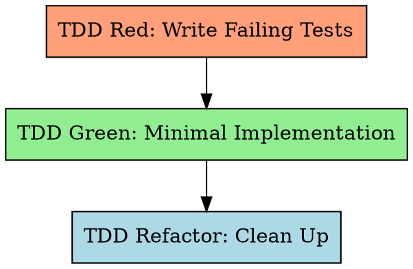

# Test-Driven Development for Long-Task

Write the test first. Watch it fail. Write minimal code to pass. Refactor.

**Violating the letter of the rules is violating the spirit of the rules.**

## The Iron Law

```
NO IMPLEMENTATION CODE WITHOUT A FAILING TEST FIRST
```

Write code before the test? Delete it. Start over. No exceptions.
- Don't keep it as "reference"
- Don't "adapt" it while writing tests
- Don't look at it
- Delete means delete

## Red-Green-Refactor Cycle



## Step 1: TDD Red — Write Failing Tests

Write tests for ALL verification_steps in the feature spec. Tests MUST fail (feature not yet implemented).

### Specification Input

Tests are driven by two primary sources:
- **`verification_steps`** from the feature spec (primary — each step becomes one or more tests)
- **SRS requirement section** (`{srs_section}`) — full FR-xxx with Given/When/Then acceptance criteria, boundary conditions, and error paths

These provide sufficient specification for writing comprehensive failing tests. ST test case documents are generated *after* TDD as acceptance verification (Worker Step 10).

### Test Scenario Rules (hard requirements)

**Rule 1: Category Coverage** — tests must cover all applicable categories:

| Category | What to test | Example |
|----------|-------------|---------|
| **Happy path** | Normal operation, valid inputs | Valid login returns token |
| **Error handling** | Known failures, invalid inputs | Invalid password returns 401 |
| **Boundary / edge** | Limits, empty, max, zero | Empty string; max-length password |
| **Security** | Injection, authorization | SQL injection in username |

When a category doesn't apply, state it explicitly in a comment:
```python
# Security: N/A — internal utility with no user-facing input
```

**Rule 2: Negative Test Ratio >= 40%**

```
negative_test_count / total_test_count >= 0.40
```

A test is "negative" if it expects an exception, error, failure state, boundary/extreme input, unauthorized access, or malformed data.

**Rule 3: Assertion Quality — Low-Value <= 20%**

```
low_value_count / total_assertion_count <= 0.20
```

Low-value assertion patterns (avoid):
- `assert x is not None` without checking content
- `assert isinstance(x, SomeType)` without behavior check
- `assert len(x) > 0` without verifying elements
- `assert "key" in dict` without checking value
- `assert bool(x)` / truthiness only
- Import-only tests (`from module import X; assert X is not None`)

**Rule 4: The "Wrong Implementation" Challenge**

For each test, ask: "What wrong implementation would this test catch?"

If "almost any wrong implementation would still pass" → rewrite with more specific assertions.

Imagine 2-3 plausible wrong implementations:
- Returns hardcoded value instead of computing
- Swaps two fields
- Off-by-one error
- Skips a validation step
- Returns stale/cached data

Would the test **fail** for each? If NO for most → rewrite.

**Rule 5: UI-Specific Test Rules** (when `"ui": true`)

- **UI Pre-condition (verify before first [devtools] step):**
  Before any Chrome DevTools MCP testing, verify the application is reachable:
  1. Confirm `start.sh` ran successfully in Worker Step 2 (Bootstrap)
  2. Use `navigate_page` to the feature's `ui_entry` URL (or default localhost URL)
  3. If connection refused or page error (ERR_CONNECTION_REFUSED, etc.) → the app is not running. DO NOT proceed with UI tests. Ask user to start services manually. Never skip UI verification.
- Every `[devtools]` step must use EXPECT/REJECT format:
  ```
  [devtools] <page-path> | EXPECT: <positive criteria> | REJECT: <negative criteria>
  ```
- Execute automated error detection script via `evaluate_script()`
- `list_console_messages(types=["error"])` must return 0 errors (unless `[expect-console-error: <pattern>]`)

See `references/ui-error-detection.md` for the full detection script and integration sequence.

### After Writing Tests

Run the test suite. **All tests must FAIL.** If any test passes → it tests nothing useful, rewrite it.

**Running tests**: Prefer `./test.sh` if available (handles env activation, tool checks, exit codes); fall back to raw command from `python scripts/get_tool_commands.py feature-list.json`. If `test.sh` exits with code 2 (tool/env error): diagnose root cause, attempt one fix, retry once, escalate to user if still failing. **Never skip.**

## Step 2: TDD Green — Minimal Implementation

Write ONLY enough code to make tests pass.

For subagent mode, dispatch with `skills/long-task-tdd/prompts/implementer-prompt.md` template:
- Provide FULL task text (don't make subagent read files)
- Include tech_stack, test command, coverage command, mutation command
- Exit criteria: all tests pass, no regressions

**Rules:**
- Implement fresh from tests — never reference pre-existing code that was "deleted" in the Iron Law
- One test at a time: make the simplest failing test pass first, then the next
- No premature optimization or extra features

## Step 3: TDD Refactor

Clean up while keeping tests green:
- Extract duplication, improve naming, simplify
- Run tests after EVERY change (use `./test.sh` if available)
- No new functionality in this step

## Testing Anti-Patterns (Top 5)

1. **Testing mock behavior** — Verify real code, not mock configuration. If you assert on mock return values, you test the mock, not the system.
2. **Implementation detail testing** — Test behavior/output, not internal structure. Don't assert method call counts or internal state.
3. **Tests that can't fail** — Every assertion must be falsifiable. If removing the implementation still passes the test, it's worthless.
4. **Gaming coverage** — Assert-free tests exercise code without verifying correctness. Coverage ≠ quality.
5. **Low-value assertions** — `assertNotNull` / `isinstance` / `len>0` without checking actual values. Max 20% of total.

Full catalog of 14 anti-patterns: Read `skills/long-task-tdd/testing-anti-patterns.md`.

## Integration

**Called by:** long-task-work (Steps 6-8)
**Dispatches:** implementer subagent (`skills/long-task-tdd/prompts/implementer-prompt.md`)
**Requires:** Plan file exists (from Work Step 5)
**Produces:** Passing tests + implementation code
**Chains to:** long-task-quality (via Work Step 9)
